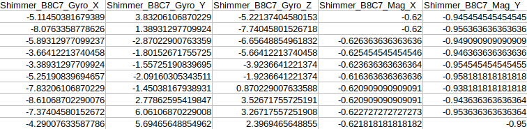

The purpose of the file `preprocess_coordinates_new.py` is to find out the peaks for segmenting the whole time series into individual signal.
It uses the config file `data_preprocessing_config` for passing arguments. Currently, the peaks information is stored 
already in the `data_info` directory after manually going through each signal and correcting the location of minima in 
case it is incorrect.

The code accepts a file that contains the data for each PID where the columns look like this:



where X, Y and Z signal are the signals for each of the accelerometer, magnetometer and gyroscope for a single sensor
named `Shimmer_B8C7`. The same pattern is there for other sensors. Please refer below for more details.

```
### Sensor Locations
    - 548D – L Arm/Shank
    - B8C7 – R Arm/Shank
    - 9276 – Lspx
    - B8E3 – R Wrist
    - 57D0 – L Wrist

The sampling rate for the data is usually 51.2 Hz in this data set but it is different for some exercises e.g. jump data. You will always be able to check this by checking a timestamp column in the files. They are in ms so you can look at 2 sequential samples and get sampling rate by looking at 2 sequential samples and using the formula:
1000/(sample(2)-sample(1))

- Reading the data is quite easy. We just have to rename the file to .csv extension.
- Description 5 sensors (lower back, 2 wrists, 2 elbows)
- Accelerometer (movement acceleration)
        Calibrated and Uncalibrated
            We have to use the calibrated one
        Low noise and wide range
            These two are approximately the same. We only have to use the LN.
        X , Y and Z coordinates
- Magnetometer (orientation/compass?)
        Calibrated and Uncalibrated
        X , Y and Z coordinates
- Gyroscope (angular velocity, degrees per second)
        Calibrated and Uncalibrated
        X , Y and Z coordinates
- Magnetometer can be used to do the segmentation
- Each sensor 33 columns
    12 from accelerometer
    6 from magnetometer
    6 from gyroscope
    Other columns
        Batt_percentage - 1
        Event Marker -1
        Packer Reception Rate Trial
        Packet Reception Rate Current
        SyncTimestamp
        System Timestamp
            Cal and uncal
        Timestamp
            Cal and uncal
- We don’t have to use the uncal data, only cal data
- Total columns: 5 sensors, 5 * 33 columns + 2 extra columns (Annotation Level and Annotation Pulse)

```

Note that this data is obtained after removing redundant signals, cleaning and merging the signals for each participant.
The arguments accepted by this code are given below.

```
EXERCISE= type of exercise
BASE_PATH=path info
FULL_COORDINATES_PATH=path info
SEGMENTED_COORDINATES_DIR=path info
SEGMENT_STATS_DIR=path info
MAGNITUDE_INFO= to calculate extra features such as magnitude and velocity etc.
SEGMENT_INFO_FILE= file containing the segmentation information for each PID
COMMON_PIDS= pids which are common to both shummer and video, used when comparing the performance
```

For each csv file, we obtain a final csv where we store the peak information for the time step corresponding to 
the maxima to segment the time series for the next part. The code also outputs additional information on the peaks. 
In addition, the code also provides the functionality to plot the peaks and save them.